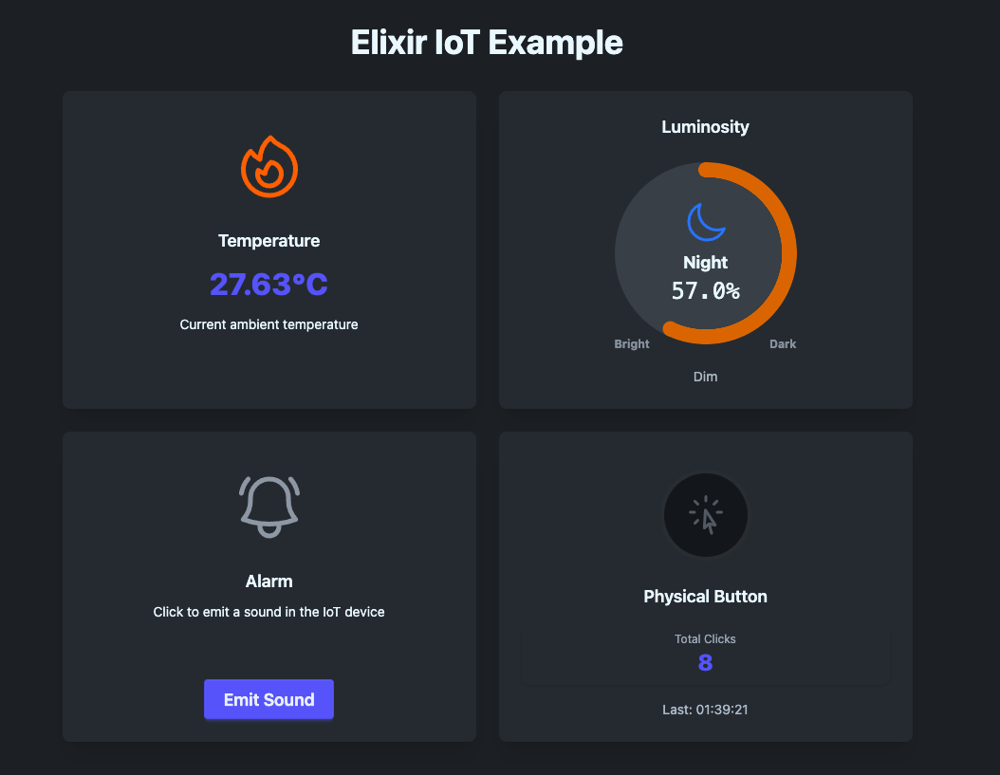
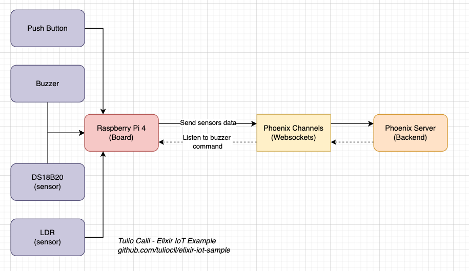

# Elixir IoT Example 🚀

<center>
  
  
  
  
  

</center>

**Elixir IoT Example** is a monorepo demonstrating how to connect a Raspberry Pi to a real-time Phoenix LiveView dashboard using **Phoenix Channels**, **WebSockets**, and **Elixir Circuits**.

It includes:

- 🌡️ Real-time temperature readings (DS18B20)
- 💡 Light level measurement using RC timing (LDR)
- 🔘 Physical button input
- 🔔 Remote buzzer control through WS commands
- 📊 Web dashboard with auto-updating LiveView

This project serves as a practical, didactic example of building IoT systems entirely in **Elixir**.

#### Requirements

- Elixir **1.17+**
- Erlang/OTP **26+**
- Node.js **16+** (for assets)
- Raspberry Pi 4 / 3 (tested with Pi4)
- Erlang + Elixir installed in the Rasp
- Enable 1-Wire in Rasp (See [doc/1-wire.md](doc/1-wire.md))

## 🏗️ Architecture and Circuit




### Running server

```bash
cd server
mix deps.get
mix phx.server
```

Open:

```
http://localhost:4000/dashboard
```

## 📡 Raspberry Pi (Elixir Circuits)

### Running

```bash
# Clone the repo on the rasp and:
cd rasp
mix deps.get
iex -S mix
```

The device will:

- connect to the Phoenix server
- join:
  - `iot:events` chanel
- read temperature & light
- send data every few ms
- listen for buzzer commands

## 🔧 Hardware Used

### **DS18B20 — Temperature Sensor**

- Digital 1-Wire
- Connected to GPIO 27 + 4.7k resistor

### **LDR + Capacitor (RC Timing)**

- LDR + 4.7μF or 10μF capacitor
- Circuit measures discharge time
- Automatically normalized and classified

### **Button (GPIO)**

- Pull-up enabled
- Sends “button_pressed” to backend

### **Active Buzzer + Transistor**

- Uses BC556 or S8050
- Controlled from Phoenix via WS
- Supports patterns (Mario) and single beep.

## 🖥️ Dashboard (LiveView)

The dashboard displays:

- Temperature (formatted, safe range checks)
- Light % + classification
- Real-time updates via LiveView
- Buzzer status
- Button press history

(You can attach screenshots here after pushing the repo.)

# 🎓 Academic Context

This project was developed by **Túlio Calil** as part of the  
**Introduction to Functional Programming (IFP 2025)** course at the  
**Postgraduate Program in Applied Computer Science (PPGCA), Federal University of Technology – Paraná (UTFPR)**.

Semester: **2025-2** — Role: **External Student** (_Estudante Externo_)

Instructor:  
**Prof. Adolfo Neto**  
🔗 https://www.linkedin.com/in/adolfont/

The implementation is based on concepts explored in my course assignment:

**“Applying Tierless Elixir Concepts to an IoT Ambient Sensor Prototype”**

The assignment analyzed the tierless architecture proposed in Li et al. (2024) and implemented a small IoT prototype showing how Elixir can unify hardware-level logic, processing, and real-time UI in a single language.

## Lessons Learned (Functional Programming)

Through the development of this prototype, several key functional programming concepts proved vital for robust IoT development:

1.  **Immutability vs. Mutable Hardware:** Modeling hardware state (which is inherently mutable) using **GenServers** demonstrated how to isolate side effects. The hardware state is encapsulated within a process loop, allowing the rest of the application to remain pure and functional.
2.  **Concurrency with the Actor Model:** Unlike imperative loops often used in embedded systems, Elixir's processes allowed decoupling the sensors. The blocking nature of the RC Timing (LDR) does not interfere with the WebSocket communication or the DS18B20 polling, as they run in isolated lightweight processes.
3.  **Declarative Data Handling:** Using **Pattern Matching** to handle binary data from sensors and payloads from WebSockets eliminated complex conditional logic, resulting in code that describes "what the data looks like" rather than "how to parse it."
4.  **Fault Tolerance:** Leveraging **Supervision Trees** ensured that a hardware glitch (e.g., a sensor read error) causes only the specific worker to restart, rather than crashing the entire device, adhering to the "Let it Crash" philosophy.

## 📝 License

MIT — free for academic, personal, or commercial use.

## 🤝 Contributing

Pull requests and improvements are welcome!
